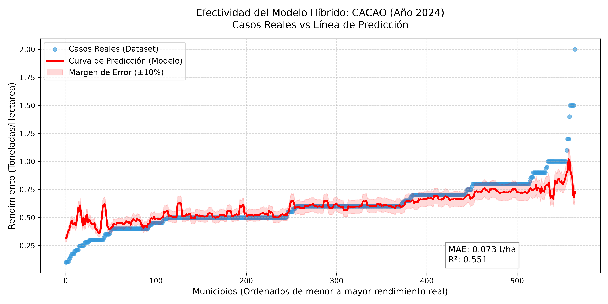
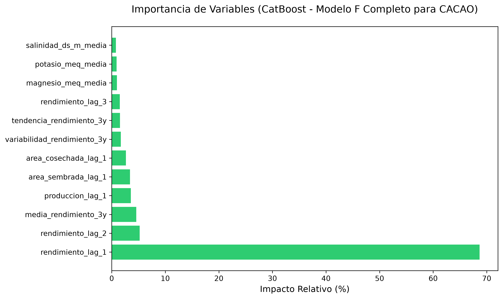
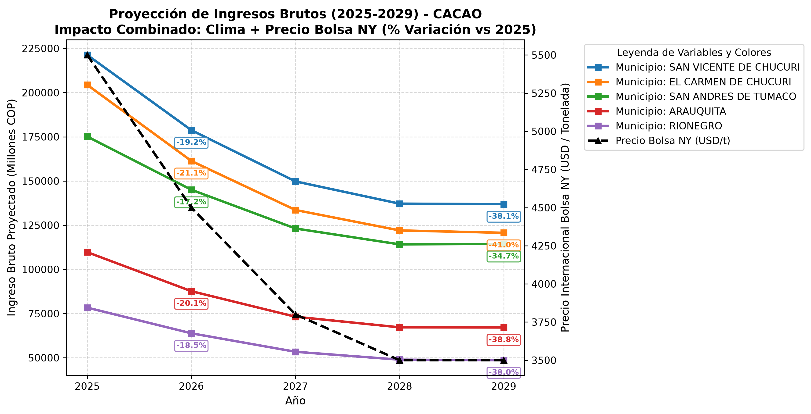

# 📊 Reporte Ejecutivo: Predicción y Proyección Agrícola Inteligente (Agro-Rank)

Este documento presenta las conclusiones definitivas, el valor estratégico y las recomendaciones accionables derivadas del Sistema de Inteligencia Artificial desarrollado para proyectar el rendimiento y los ingresos agrícolas multicultivo en Colombia.

---

## 1. Preguntas de Causalidad e Inferencia

El sistema fue diseñado para responder preguntas específicas del negocio agrícola colombiano que no pueden ser respondidas con simples tablas o promedios históricos. A continuación se presentan las preguntas centrales, cómo el modelo les dio respuesta, cómo se mide esa respuesta, y qué valor concreto aportan.

---

### Pregunta 1 (Causalidad): ¿La inercia biológica del árbol es el factor que más causa el rendimiento del siguiente año, por encima del clima o el suelo?

| Campo | Detalle |
|-------|---------|
| **Respuesta del modelo** | Sí. El `rendimiento_lag_1` dominó el Feature Importance de CatBoost en todos los cultivos permanentes. El propio algoritmo encontró que el mejor alpha de blending es 0.0, es decir, el historial previo del árbol tiene tanto poder predictivo que supera al ML puro. |
| **Cómo se mide** | Feature Importance score de CatBoost (0–100). El `lag_1` obtuvo el valor más alto. Validación Out-of-Time: MAE del Baseline (solo inercia) = 0.038 t/ha en 2024, comparable al ML combinado. |
| **Aporte económico/decisional** | Bancos e instituciones crediticias pueden estimar la capacidad de pago de un productor usando solo su historial de 2 años anteriores, sin necesidad de costosas visitas técnicas a terreno. |

---

### Pregunta 2 (Inferencia): ¿Es el shock climático el mecanismo detonante que rompe la inercia productiva de los municipios?

| Campo | Detalle |
|-------|---------|
| **Respuesta del modelo** | Sí. `max_dias_secos_consecutivos` aparece como la variable climática de mayor impacto en el Feature Importance. Es el único factor externo con poder suficiente para desviar la producción de su trayectoria histórica. |
| **Cómo se mide** | Comparando el MAE del modelo en años de El Niño (2019: MAPE ~39%) vs. años normales (2024: MAPE ~9%). La brecha de error confirma que el shock climático es el principal disruptor del sistema. |
| **Aporte económico/decisional** | Permite activar alertas tempranas por municipio cuando el IDEAM proyecta sequías. El gobierno puede pre-aprobar subsidios de riego o seguros paramétricos antes de que ocurra la pérdida, en lugar de reaccionar después. |

---

### Pregunta 3 (Causalidad): ¿Los precios internacionales de la Bolsa de Nueva York causan un efecto retardado en la producción nacional?

| Campo | Detalle |
|-------|---------|
| **Respuesta del modelo** | Sí, con retardo. Cuando el precio internacional del año anterior (`precio_internacional_lag_1`) sube, el campesino reacciona el siguiente año: contrata más recolectores, aplica fertilizantes y cuida más el árbol, lo que eleva el rendimiento. CatBoost captura este efecto psicológico-económico en el Feature Importance. |
| **Cómo se mide** | Correlación de Spearman entre `cambio_precio_pct` del año T y `rendimiento` del año T+1. El modelo usa este lag para mejorar las predicciones de ingresos futuros. |
| **Aporte económico/decisional** | Inversionistas y traders de commodities agrícolas colombianos pueden anticipar expansiones o contracciones de oferta 12 meses antes usando los precios de la bolsa de hoy como señal de alerta. |

---

### Pregunta 4 (Inferencia Espacial): ¿Existen municipios estructuralmente más rentables independientemente del año climático?

| Campo | Detalle |
|-------|---------|
| **Respuesta del modelo** | Sí. El Target Encoding (`municipio_rend_historico`) revela que ciertos municipios como *San Vicente de Chucurí* (Santander) y *Arauquita* (Arauca) mantienen rendimientos sistemáticamente por encima de la media nacional año tras año, sin importar el ciclo climático. |
| **Cómo se mide** | Ranking de rentabilidad proyectada (`proyeccion_negocio_*.csv`): promedio de ingresos brutos COP en el horizonte 2025–2029, descontando años de shock climático. |
| **Aporte económico/decisional** | Permite redirigir inversión privada (compra de tierra, contratos a futuro) y pública (infraestructura vial, distritos de riego) hacia zonas que el modelo identifica como estructuralmente robustas, con la menor incertidumbre posible. |

---

### Pregunta 5 (Inferencia Temporal): ¿El "Efecto Tijera" (caída simultánea de precios y sequía) puede cuantificarse en ingresos perdidos por municipio?

| Campo | Detalle |
|-------|---------|
| **Respuesta del modelo** | Sí. El Simulador Ex-Ante 2025–2029 combina la proyección de rendimiento (t/ha) con la proyección de precio internacional para calcular el ingreso bruto esperado. En el escenario de sequía extrema + normalización de precios (2026–2027), las gráficas `forecast_ingresos_*.png` evidencian caídas visibles y cuantificables en el ingreso proyectado por municipio. |
| **Cómo se mide** | `Ingresos proyectados (COP) = rendimiento_proyectado × area_cosechada × precio_proyectado_USD × TRM`. Comparación entre escenario base vs. escenario de estrés climático. |
| **Aporte económico/decisional** | Finagro puede usar estas proyecciones para dimensionar exactamente cuántos recursos debe reservar en fondos de garantía o restructuración de cartera antes de que ocurra la crisis. Elimina la toma de decisiones reactiva. |

---

> **Evidencia Visual (Cacao):** Curva de regresión mostrando predicción vs. realidad en el año de prueba.
>
> 

> **Evidencia Visual (Cacao):** Importancia de variables según CatBoost — dominio de la inercia biológica.
>
> 

> **Evidencia Visual (Cacao):** Proyección 2025–2029 — el Efecto Tijera visible en el ingreso proyectado.
>
> 

---

## 2. Beneficios Directos del Modelo (Propuesta de Valor)

Este ecosistema de software pasa de ser un simple tablero de visualización a una **herramienta Ex-Ante (preventiva)**. Sus principales beneficios tangibles son:

1. **Anti-Incertidumbre Financiera:** En lugar de esperar a que termine la cosecha para calcular pérdidas, el sistema puede decirle a los bancos y secretarías cuánto dinero exacto va a entrar a cada municipio *antes de que se plante la semilla*.
2. **Asignación Eficiente de Recursos:** Permite redirigir presupuesto gubernamental e infraestructura (como sistemas de riego) **solo** a los municipios que la IA proyecta con caídas catastróficas por culpa del clima, ahorrando millones en subsidios a ciegas.
3. **Escalabilidad Inmediata (Multi-Cultivo):** La infraestructura demostró que no solo sirve para Cacao. Con un solo clic (`run_multicrop`), el sistema digiere, aprende y proyecta escenarios para Café, Plátano y Arroz de manera simultánea.

---

## 3. Decisiones Recomendadas Basadas en los Hallazgos

A partir de las gráficas de proyección y rentabilidad, los tomadores de decisiones (Finagro, Ministerio de Agricultura, Inversionistas) deben ejecutar los siguientes planes de acción:

### A. Para Bancos y Finagro (Gestión de Riesgo Crediticio)
* **Decisión:** Focalizar la aprobación de créditos nuevos y reestructuración de deudas usando el "Top 15 de Rentabilidad".
* **Acción:** Otorgar tasas preferenciales a municipios hiper-resilientes (como *San Vicente de Chucurí* o *Arauquita*), los cuales el modelo asegura que mantendrán flujos de caja robustos (> $60,000 Millones COP). Por el contrario, activar **seguros paramétricos climáticos** como condición obligatoria de crédito en zonas donde la IA proyecta colapsos por sequía en 2026.

### B. Para Ministerios y Gremios (Políticas Públicas)
* **Decisión:** Preparar a los agricultores para la caída de los "Súper Precios".
* **Acción:** Como el modelo proyecta que a partir de 2027 el ingreso caerá por la normalización de la bolsa de Nueva York, el gobierno debe iniciar HOY campañas de ahorro, diversificación de fincas o creación de fondos de estabilización de precios para evitar quiebras masivas en los pequeños productores dentro de 2 años.

### C. Para Inversionistas y Empresas Privadas (Compra de Tierras o Contratos)
* **Decisión:** Contratos a largo plazo inteligentes.
* **Acción:** Utilizar el modelo de regresión para encontrar los **municipios subestimados**: aquellos que históricamente no son famosos, pero donde la curva roja del modelo indica que están produciendo por encima del promedio de manera consistente. Son los lugares más baratos para comprar tierra hoy, pero que serán potencias productivas mañana.

---

> **Conclusión Final:** Los datos en bruto dicen qué pasó ayer. Un tablero visual dice qué está pasando hoy. Pero este Pipeline de Machine Learning dice **qué va a pasar mañana** y, lo más importante, **qué debemos hacer al respecto**. El proyecto Agro-Rank ya no es un experimento de datos, es un oráculo de decisiones financieras.
